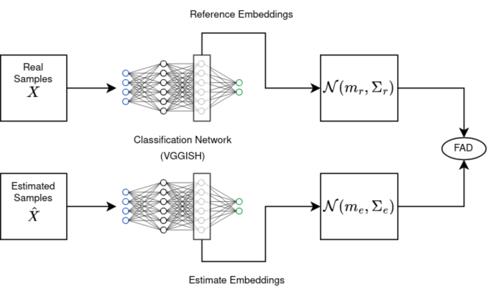

# Frechet Audio Distance

[](https://codecov.io/gh/jollyjonson/frechet_audio_distance)
[](https://github.com/jollyjonson/frechet_audio_distance/actions/workflows/main.yml)

This is a TensorFlow 2.x based implementation of the Frèchet Audio Distance as a keras metric. 
The FAD was proposed by Kilgour et al. in [1] and is a non-reference i.e. blind audio metric.

## Installation
Install this package straight from GitHub using
```bash
python -m pip install 'frechet_audio_distance @ git+https://github.com/jollyjonson/frechet_audio_distance@v1.0.3'
```
Or clone the repository, navigate into the main directory containing the `setup.py` and install the package in development mode. You can also chose to not install it in development mode by omitting the `-e` flag.
```bash
git clone https://github.com/jollyjonson/frechet_audio_distance
cd frechet_audio_distance
pip install -e .
```

## Usage

Usage from the command line is simple, just give it a set of reference and estimate files and the FAD will be computed for these
```bash
python -m frechet_audio_distance -r reference_file1.wav reference_file2.wav -e estimate_file1.wav estimate_file2.wav
```
Note that the file format must be supported by `librosa.core.audio.load` for this to work.

You can also use the FAD as a normal stateful keras metric, here's a synopsis of that:
```py
from frechet_audio_distance import FrechetAudioDistance

# Instantiate the FAD class with the sample rate of the audio
# it will be given
fad_instance = FrechetAudioDistance(sample_rate=16000)

# Give audio to the metric, repeat this as often as needed
fad_instance.update_state(y_true_audio, y_pred_audio)

# Compute the final result
print(f"The FAD is {fad_instance.result().numpy()}")
```
If you want to use the method in a call to `model.fit`, please also supply the `RunFrechetAudioDistanceOnlyOnValidationAndTestCallback`, which can be found along the metric class to make sure the FAD is only computed during validation and evaluation.
Computing the FAD during training will most likely hinder the training performance too much.

## Contributing
Contributions are welcome!
If you are looking for something specifically, IMO finding new embedding models that are maybe closer related to human
perception as the one given in the original paper might be a worthwhile contribution.
If you wish to contribute, please:

1. Fork the repository.
2. Create a new branch: git checkout -b feature-branch.
3. Make your changes and commit them: git commit -am 'Add new feature'.
4. Push to the branch: git push origin feature-branch.
5. Submit a pull request.

## Acknowledgements
Thanks to the original authors of the FAD paper for the amazing idea and open sourcing their code as well as the model weights.
Without these, this package would not have been possible.

Also thanks to [zplane.development](https://licensing.zplane.de/) (go and license their SDKs, they are amazing), who allowed me to open-source this project that was partly written during my employment there.

## Literature
[1] Kilgour, K., Zuluaga, M., Roblek, D., & Sharifi, M. (2019).
    Fréchet Audio Distance: A Reference-Free
    Metric for Evaluating Music Enhancement Algorithms.
    In INTERSPEECH (pp. 2350-2354). https://arxiv.org/pdf/1812.08466.pdf